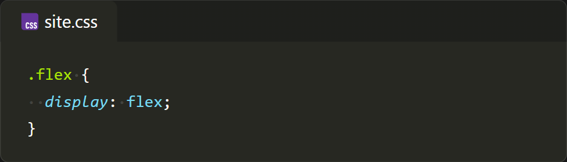
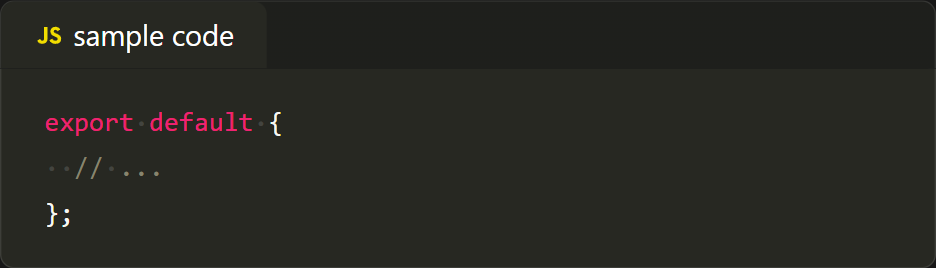
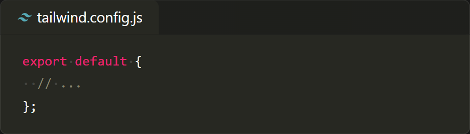
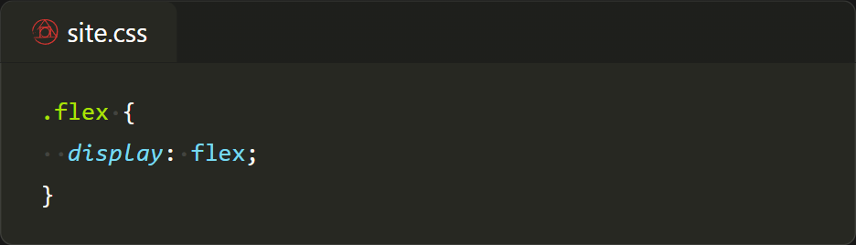
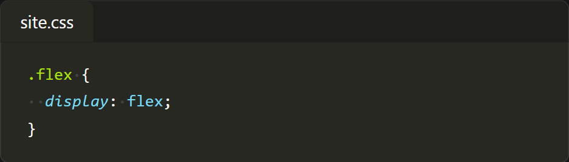
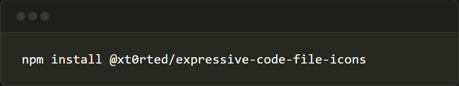

# @xt0rted/expressive-code-file-icons

Add Visual Studio Code file icons to your [Expressive Code](https://expressive-code.com/) frames.

```console
npm install @xt0rted/expressive-code-file-icons
```

Using with [Astro](https://astro.build/).

```diff
+import { pluginFileIcons } from "@xt0rted/expressive-code-file-icons";

 export default defineConfig({
   integrations: [
     astroExpressiveCode({
       plugins: [
+        pluginFileIcons({
+          iconClass: "size-4",
+          titleClass: "flex items-center gap-1",
+        }),
       ],
       frames: {
         extractFileNameFromCode: true,
       },
     }),
   ],
 });
```

## Frames with titles

### Default icons

The file name in the `title` prop is used to determine the icon.
If an icon can't be found based on the title then the language of the code block will be used.

#### Input

````md
```css title="site.css"
.flex {
  display: flex;
}
```
````

````md
```js title="sample code"
export default {
  // ...
};
```
````

````md
```js title="tailwind.config.js"
export default {
  // ...
};
```
````

#### Output







### Specifying and overriding an icon

If your title doesn't have a file name, or you don't want to use the default language icon, you can specify one using the `icon` prop.

#### Input

````md
```css title="site.css" icon="postcss"
.flex {
  display: flex;
}
```
````

#### Output



### No icons

Icons can be removed from a frame by adding the `no-icon` prop to the code block.

#### Input

````md
```css title="site.css" no-icon
.flex {
  display: flex;
}
```
````

#### Output



## Frames without title

An icon will not be added to a frame if it doesn't have a title.

## Terminal frames

Terminal frames don't have icons.

#### Input

````md
```console title="Test script" icon="powershell"
npm install @xt0rted/expressive-code-file-icons
```
````



## Supported icons

See [icon-names.ts](src/icon-names.ts) for all supported icons.

This plugin uses the icons from [vscode-icons](https://github.com/vscode-icons/vscode-icons) and will be kept current as best as possible.
If there's an issue with an icon, or one is missing, open an issue about it.
