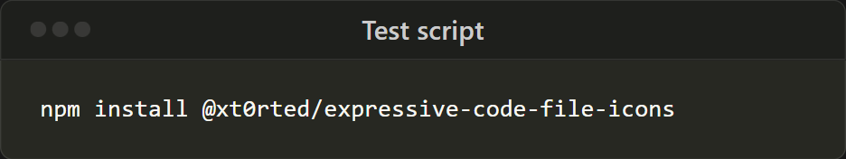

# @xt0rted/expressive-code-file-icons

Add Visual Studio Code file icons to your [Expressive Code](https://expressive-code.com/) frames.

```console
npm install @xt0rted/expressive-code-file-icons
```

Using with [Astro](https://astro.build/).

```diff
+import { pluginFileIcons } from "@xt0rted/expressive-code-file-icons";

 export default defineConfig({
   integrations: [
     astroExpressiveCode({
       plugins: [
+        pluginFileIcons({
+          iconClass: "size-4",
+          titleClass: "flex items-center gap-1",
+        }),
       ],
       frames: {
         extractFileNameFromCode: true,
       },
     }),
   ],
 });
```

## Frames with titles

### Default icons

By default the file name in the `title` is used to determine the icon.

#### Input

````md
```css title="site.css"
.flex {
  display: flex;
}
```
````

#### Output


### Specific icons

Sometimes your title doesn't have a file name, if that's the case then you can specify a specific icon to use with the `icon` prop.

#### Input

````md
```css title="Sample" icon="css"
.flex {
  display: flex;
}
```
````

#### Output


### Overriding icons

If the title doesn't include a file extension, or you want to use a different icon than the default, you can specify one using the `icon` prop.

#### Input

````md
```css title="site.css" icon="postcss"
.flex {
  display: flex;
}
```
````

````md
```css title="Sample" icon="css"
.flex {
  display: flex;
}
```
````

#### Output

 

## Terminal frames

Terminal frames don't have icons.



## Supported icons

See [iconNames.ts](src/iconNames.ts) for all supported icons.

This plugin uses the icons from [vscode-icons](https://github.com/vscode-icons/vscode-icons) and will be kept current as best as possible.
If there's an issue with an icon, or one is missing, open an issue about it.
